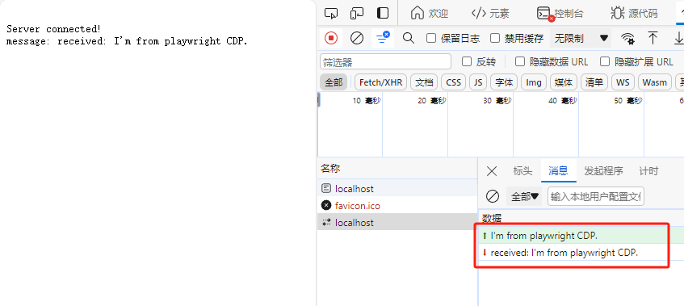

# Playwright Websocket
This is a demo for using [playwright](https://github.com/microsoft/playwright) and [CDP](https://chromedevtools.github.io/devtools-protocol/tot/Runtime/) `Runtime` to send message to websocket in website.

# Usage
```bash
npm i
npm run web
# open a new terminal
npm run start
```


